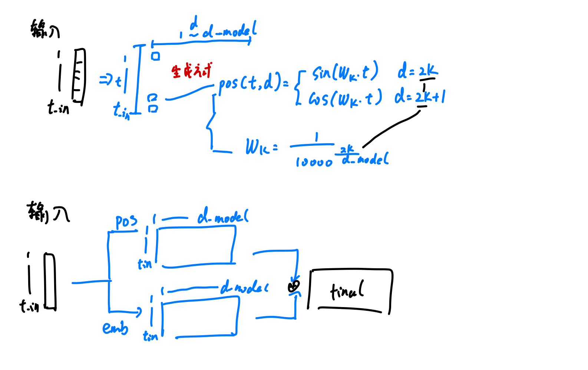
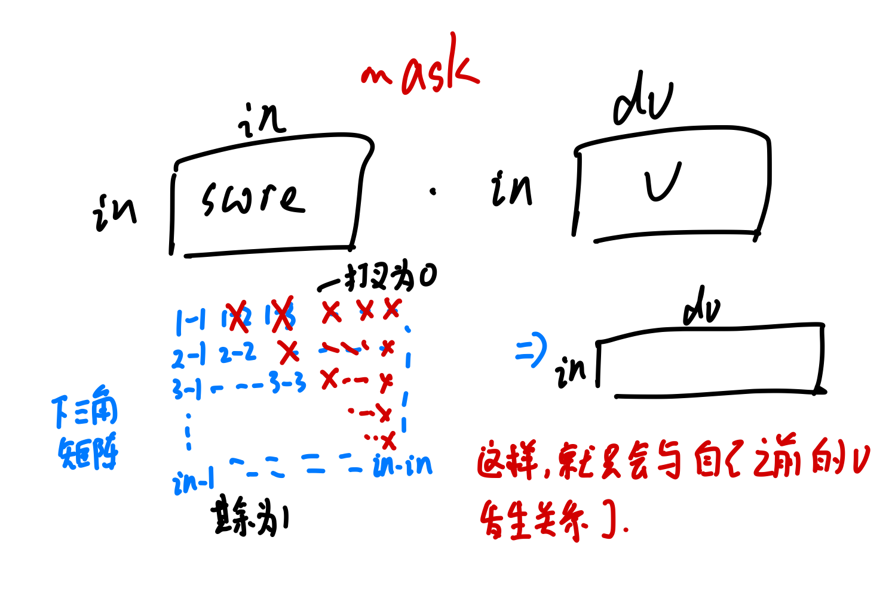
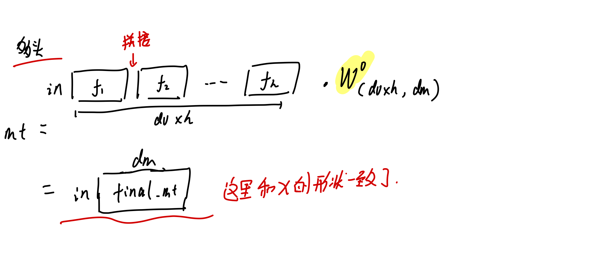

# 基础 -- Transformer

[[TOC]]

## 0.资料网址：

- [详细的解释](https://jalammar.github.io/illustrated-transformer/)

- [d2l网址](https://classic.d2l.ai/chapter_attention-mechanism/transformer.html)

  

## 0. positional encodering

- 参考网址https://kazemnejad.com/blog/transformer_architecture_positional_encoding/
- 对于当前posititonal encodering的相对位置的证明https://timodenk.com/blog/linear-relationships-in-the-transformers-positional-encoding/

### 0.1 为什么需要positional encodering，普通的为何不行

- 模型需要对位置有个概念，需要知道单词的先后顺序
- 但是因为attention的存在，所有的单词是同时间输入到模型的

- 为何不能简单的用[0,1]或者[1,2, , length_word]对每个单词进行赋值
  - 简单的用[0,1]的话，不同句子长度不一样，而每个不同长度的句子，数值间隔步长就不一样
    -  比如长度为5的句子单词间隔0.2，长度为10的句子单词间隔0.1
    - 这样就导致了，单词的数值间隔的不一致，难以表征顺序，影响学习
  - 如果使用[1,2, , length_word]的话
    - 模型的输入的句子的长度不一致，如果位置编码与长度相关的话，如果模型没见过一些长度的句子，也容易影响学习
    - 比如常见的都是12长的，如果输入100长的，后面的位置编码模型都没见过

### 0.2 位置编码需要的特性

> Ideally, the following criteria should be satisfied:
>
> - It should output a unique encoding for each time-step (word’s position in a sentence)
> - Distance between any two time-steps should be consistent across sentences with different lengths.
> - Our model should generalize to longer sentences without any efforts. Its values should be bounded.
> - It must be deterministic.

- 编码是确定性的，不取决于输入长度
- 每一个位置编码唯一
- 每两个位置的相对间隔是一致的，如1和2 以及 5和6 之间需要有一致的间隔，比如0.1
- 可以使用更长的输入序列

### 0.3 当前的位置编码

## 1. self-attention

### 1.1 归一化

为何要除以根号dk，是因为，相乘求和之后，方差为变大变为原来的dk倍数。

- 因此，除以根号dk其实是一个z的归一化，使其方差继续变为1

### 1.2 如何mask

## 2. 多头注意力

## 3. Point-wise FFN

## 4. 模型参数计算

