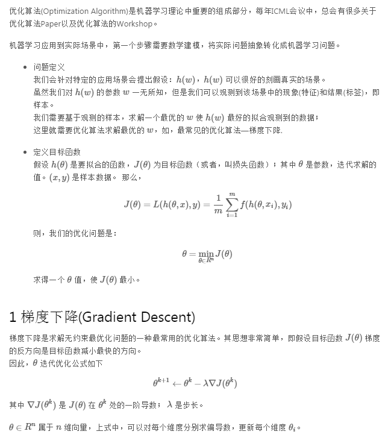
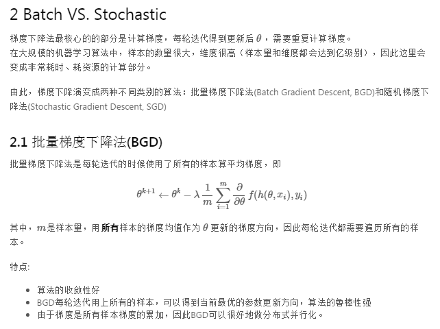
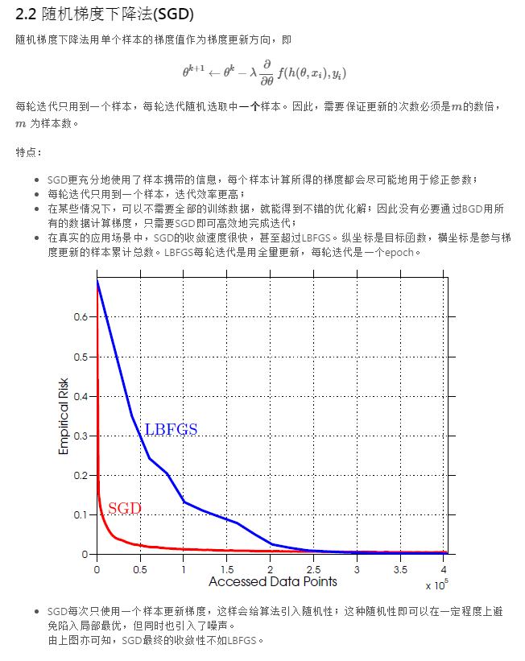
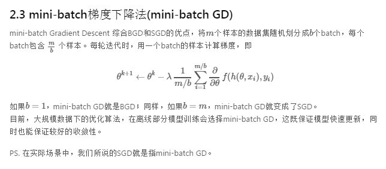
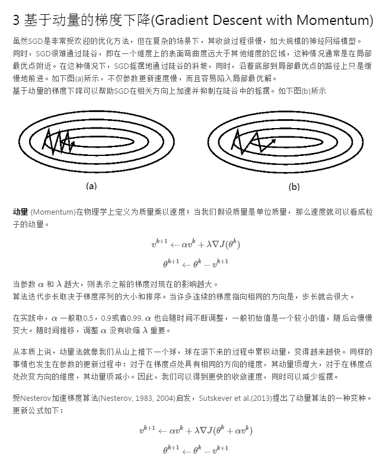
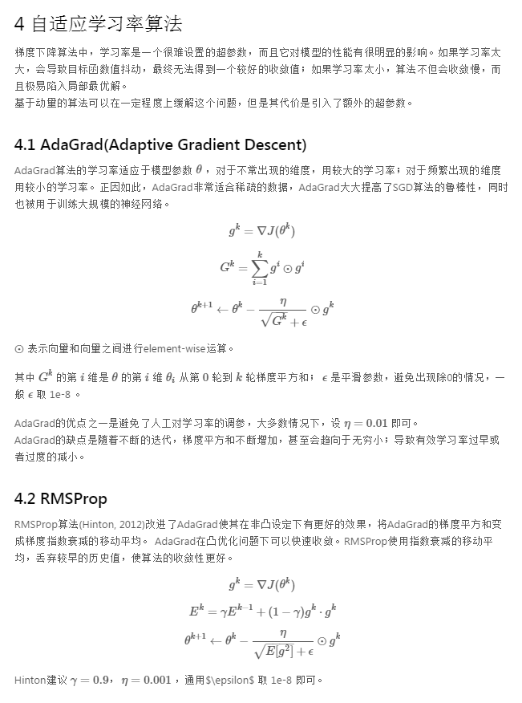
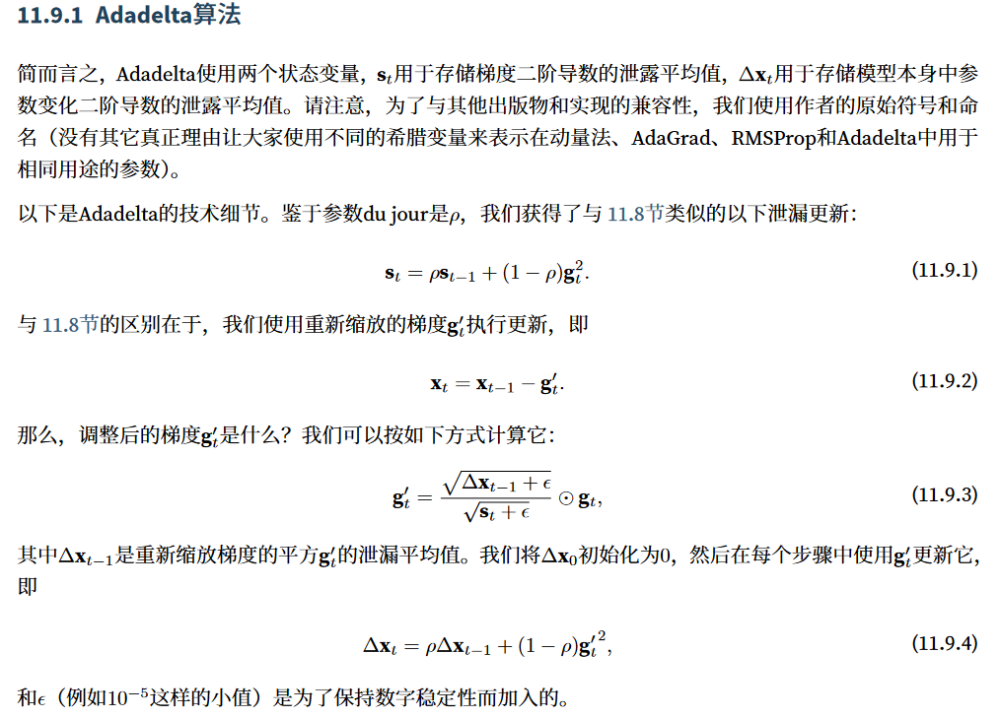
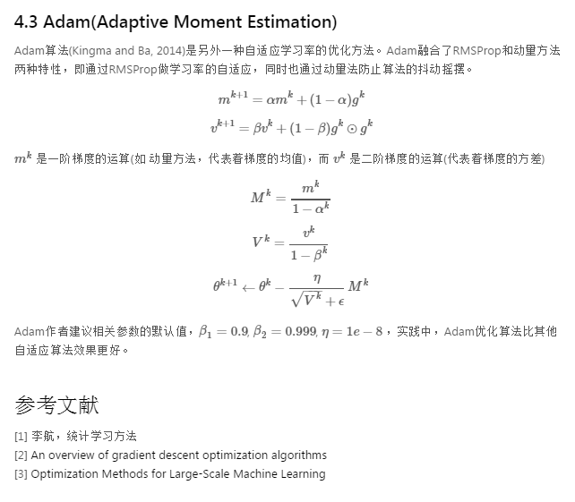

# 基础神经网络--优化器

[[TOC]]

## 0.资料网址：

- [飞桨文档](https://paddlepedia.readthedocs.io/en/latest/index.html)

- [Deep Learning Book](https://www.deeplearningbook.org/)

- [AdamDelta的参考Dive into deep learning](https://zh.d2l.ai/chapter_optimization/index.html)

- [本文所有图片的主要参考](https://cloud.tencent.com/developer/article/1520505)

- [另一个好的参考](https://github.com/gdyshi/ml_optimize)

  

## 1. 问题定义

## 2.普通梯度下降

## 3.梯度下降变种

## 4.AdaGrad, RMSprop,AdaDelta, Adam

